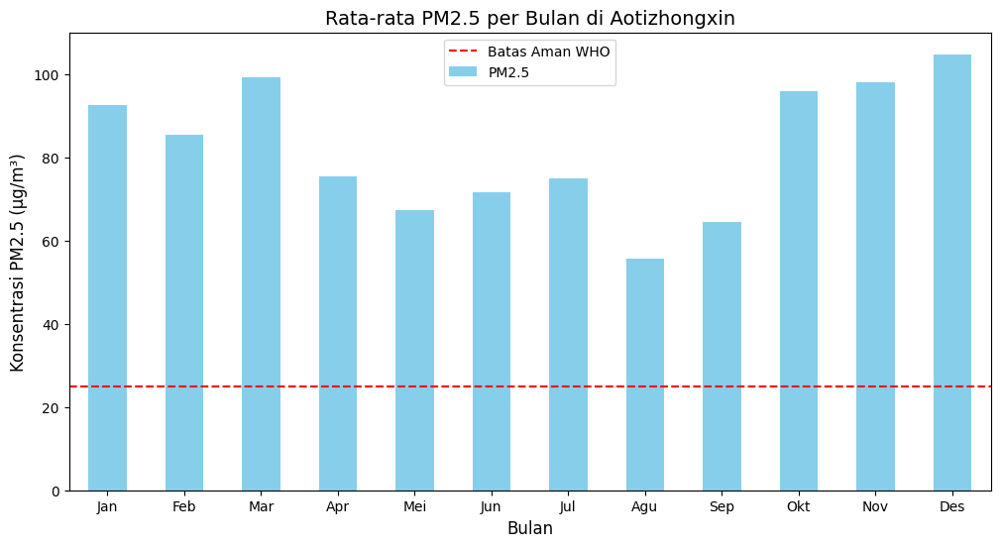
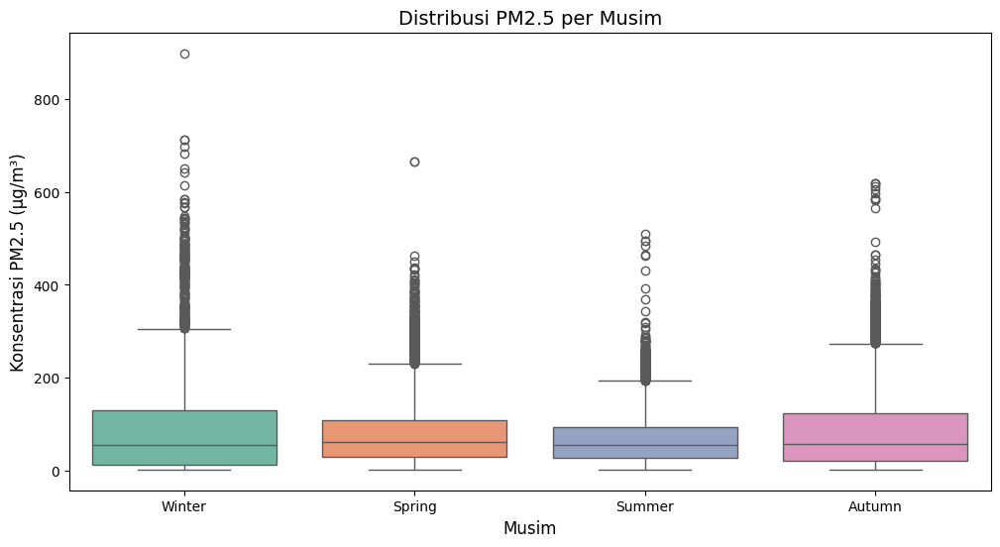

# 🌬️ Air Quality Dashboard & Analysis Project

  

*Visualizing air quality trends for a cleaner future*

---

## 📋 Project Overview

Welcome to the **Air Quality Dashboard & Analysis Project**! This project dives into the **Air Quality Dataset** from Aotizhongxin station (2013-2017) to uncover insights about air pollution trends and its relationship with environmental factors. Built with Python, Streamlit, and a sprinkle of data science magic, this repository contains both an in-depth analysis notebook and an interactive dashboard.

### 🎯 Objectives
- **Analyze**: Explore PM2.5 trends and its correlation with temperature.
- **Visualize**: Create clear, actionable visualizations to communicate findings.
- **Interact**: Provide a user-friendly dashboard for real-time data exploration.

---

## 🚀 Features

- **Exploratory Data Analysis (EDA)**: Detailed analysis in a Jupyter Notebook.
- **Interactive Dashboard**: Built with Streamlit for dynamic filtering and visualization.
- **Two Key Insights**:
  1. Yearly trends of PM2.5 concentration.
  2. Relationship between temperature and PM2.5 levels.

---

## 🛠️ Tech Stack

| **Category**      | **Tools**              |
|-------------------|------------------------|
| **Programming**   | Python 3.x            |
| **Data Analysis** | Pandas, NumPy         |
| **Visualization** | Matplotlib, Seaborn   |
| **Dashboard**     | Streamlit             |
| **IDE**           | Jupyter Notebook      |

---

## 📊 Business Questions

1. **How has the PM2.5 concentration in Aotizhongxin changed from 2013 to 2017?**  
   *Tracking air quality trends over time.*
2. **What is the relationship between temperature and PM2.5 levels?**  
   *Understanding environmental impacts on pollution.*

---

## 📂 Repository Structure

```
air-quality-project/
├── Dashboard/      # Streamlit dashboard code
    └──dashboard.py 
├── Dataset/
    └──air_quality_data.csv       # Dataset file (Air Quality Aotizhongxin)
├── Coding_Camp_Proyek_Analisis_Data.ipynb    # Jupyter Notebook with full analysis
├── README.md                 # This file
└── requirements.txt          # Python dependencies
```

---

## 🏃‍♂️ Getting Started

### Prerequisites
- Python 3.8+
- Git installed
- Basic knowledge of command line

### Installation

1. **Clone the Repository**  
   ```bash
   git clone https://github.com/yourusername/air-quality-project.git
   cd air-quality-project
   ```

2. **Install Dependencies**  
   ```bash
   pip install -r requirements.txt
   ```

3. **Prepare the Dataset**  
   - Ensure `air_quality_data.csv` (*change the file name depending on the situation*) is in the root directory (or update the file path in the code).

### Running the Project

#### 1. Explore the Analysis
- Open `Coding_Camp_Proyek_Analisis_Data.ipynb` in Jupyter Notebook:
  ```bash
  jupyter notebook analysis_notebook.ipynb
  ```
- Run all cells to see the full analysis and visualizations.

#### 2. Launch the Dashboard
- Start the Streamlit app:
  ```bash
  streamlit run dashboard.py
  ```
- Open your browser at `http://localhost:8501`.

---

## 📈 Sample Visualizations

### PM2.5 Yearly Trend


### Temperature vs PM2.5



---

## ✨ Key Insights

- **Trend Analysis**: PM2.5 levels show yearly fluctuations, with some years indicating higher pollution.
- **Correlation**: A weak negative correlation exists between temperature and PM2.5—colder temperatures tend to align with higher pollution levels.

---

## 🤝 Contributing

Contributions are welcome! Here’s how you can help:
1. Fork the repository.
2. Create a new branch (`git checkout -b feature-branch`).
3. Commit your changes (`git commit -m "Add cool feature"`).
4. Push to the branch (`git push origin feature-branch`).
5. Open a Pull Request.

---

## 📧 Contact

- **Author**: Muhammad Alif  
- **Email**: [m.alif7890@gmail.com](mailto:m.alif7890@gmail.com)  
- **Dicoding ID**: miezlearning  

Feel free to reach out for questions or collaboration!

---

## 📜 License

This project is licensed under the MIT License - see the [LICENSE](LICENSE) file for details.

---

⭐ *If you find this project useful, give it a star!* ⭐

